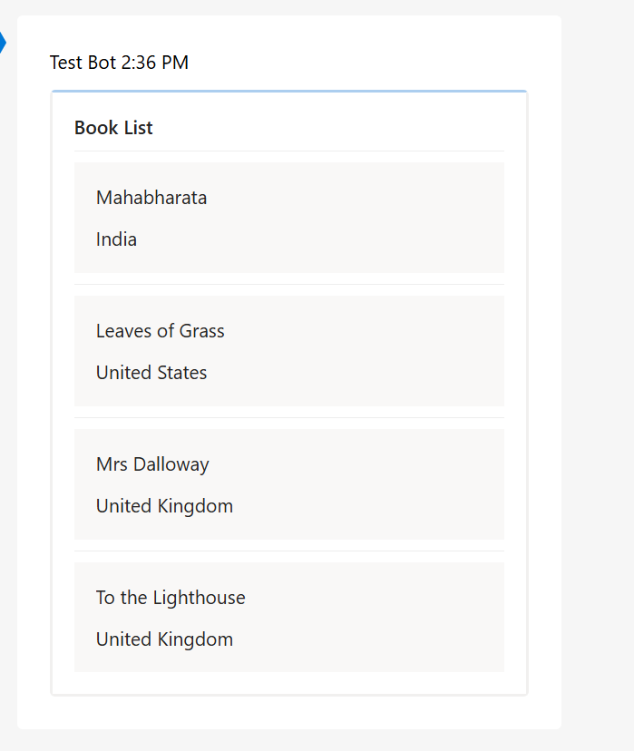

# Scenarios

you have a book list, and want to post it to a Microsoft Teams channel every month.

The book list can be retrieved via an API, and the content will be updated weekly. We decided to use Logic App to push the book list.

Here is an example of the API response body:

```json
{
  "title": "Book List",
  "items": [
    {
      "country": "India",
      "title": "Mahabharata"
    },
    {
      "country": "United States",
      "title": "Leaves of Grass"
    },
    {
      "country": "United Kingdom",
      "title": "Mrs Dalloway"
    },
    {
      "country": "United Kingdom",
      "title": "To the Lighthouse"
    }
  ]
}
```

The Adaptive Card code will be:

```json
{
  "type": "AdaptiveCard",
  "body": [
    {
      "type": "TextBlock",
      "wrap": true,
      "weight": "bolder",
      "text": "${title}"
    },
    {
      "type": "Container",
      "separator": true,
      "spacing": "Medium",
      "style": "emphasis",
      "$data": "${items}",
      "items": [
        {
          "type": "TextBlock",
          "text": "${title}"
        },
        {
          "type": "TextBlock",
          "text": "${country}"
        }
      ]
    }
  ],
  "$schema": "http://adaptivecards.io/schemas/adaptive-card.json",
  "version": "1.4"
}
```

The card will look like:



In order to build the book list, we need to:

- Initate an array varaible `BookList`
- Append the first card element to the array
  ```json
  {
    "type": "TextBlock",
    "wrap": true,
    "weight": "bolder",
    "text": "body('HTTP')?['title']"
  }
  ```
- Iterate the `items` array in the body, append it to the `BookList`

  ```json
  {
    "type": "Container",
    "separator": true,
    "spacing": "medium",
    "style": "emphasis",
    "items": [
      {
        "type": "TextBlock",
        "wrap": true,
        "weight": "bolder",
        "text": "@{item()?['title']}"
      },
      {
        "type": "TextBlock",
        "text": "@{item()?['country']}"
      }
    ]
  }
  ```

- Add `Compose` action, take the `BookList` as inputs.
- Put the outputs of `Compose` in the Adaptive Card template

  ```json
  {
    "$schema": "http://adaptivecards.io/schemas/adaptive-card.json",
    "type": "AdaptiveCard",
    "version": "1.4",
    "body": @{outputs('Compose')}
  }
  ```

## Links

- https://adaptivecards.io/designer/
- https://learn.microsoft.com/en-us/azure/logic-apps/logic-apps-overview 
